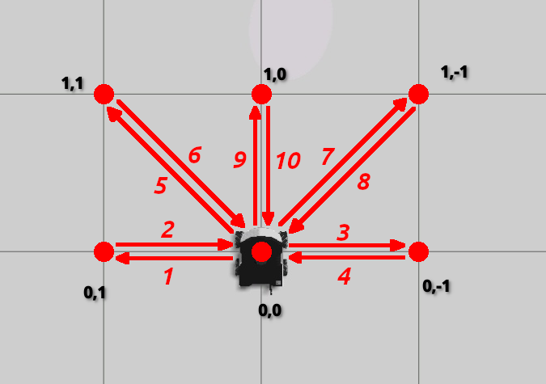

# ROSBot XL robot Maze Solver
A demonstration for solving and maneuvering through the maze in both simulation and real world.  

## Waypoint Recording

Waypoints can be recorded through the waypoint_recorder_XXX.py script which is available under `misc` directory. The below image is for reference while recording the waypoints.
usage,
```bash.sh
cd ~/ros2_ws/src/ROSBot_XL_mazesolver/misl
python3 waypoint_recorder_json.py -waypoint <waypoint number>
```
> [NOTE] 
> The below part has to be done manually. moving the waypoints.json to resources/waypoints and adding a prefix.

Once a waypoint.json file is generated under the same directory. Do a general inspection of that file, add a `sim_` or `real_` prefix to the waypoint.json file and move it inside the `resources/waypoints` directory.

## Distance Controller
### Task 1
Run the distance controller to achive the below motion testing in an empty world as shown in the below image


Start the empty world
```bash.sh
source ~/ros2_ws/install/setup.bash
ros2 launch rosbot_xl_gazebo empty_simulation.launch.py mecanum:=true
```

Run distance controller. Alternatively to experiment with PID values you can pass in the values directly
```bash.sh
ros2 run distance_controller distance_controller
ros2 run distance_controller distance_controller --ros-args -p kP:=0.5 -p kI:=0.02 -p kD:=1.2
```
### Task 2
In this section based on the selected `scene_number` (1-simulation & 2-real), waypoints are selected and passed on to distance controller.
ROSBot_XL executes movement based on the extra argument `num_waypoints`, where you can select number of waypoints from the home position to be executed directly from command like. Default waypoints selected will be `3`.
Once it reached the last waypoint(num_waypoints passed in), it returns back to its home position.
[See waypoints](#waypoint-recording)

> [Note]
> For this section if the waypoints json files are present under the resources/waypoints, generate them first [Waypoint Recording](#waypoint-recording) section

```bash.sh
ros2 run distance_controller distance_controller 2
ros2 run distance_controller distance_controller 1 --ros-args -p num_waypoints:=4
ros2 run distance_controller distance_controller 1 --ros-args -p odom_topic:=/rosbot_xl_base_controller/odom
ros2 run distance_controller distance_controller 1 --ros-args -p num_waypoints:=6 -p kP:=0.5 -p kI:=0.02 -p kD:=1.2
```
